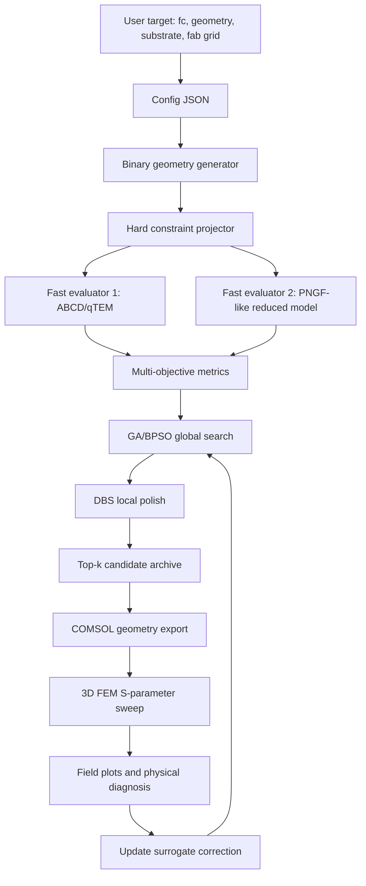

# Route B 详细研究计划：Binary AI 反演设计 0.8 THz On-Chip CPS Low-Pass Filter

## 0. 当前项目位置和原则

当前项目根目录：

```text
/Users/lukuan/Desktop/ Quantum Engineering/AI_THZ/routeB_binary_ai_lpf
```

注意：`Desktop/ Quantum Engineering` 中 `Quantum Engineering` 前面有一个空格。VSCode、MATLAB、Python 里引用路径时必须保留这个空格。

本计划以当前 `AI_THZ` 文件夹为主工作区。旧的 `COMSOL_MAT` 中如果还有历史 MATLAB/COMSOL 脚本，只作为 legacy source。后续应把真正要复用的脚本复制或重构进本项目，避免研究链条散落在多个目录。

核心研究原则：

1. 先可复现，再追求性能。
2. 先快速 surrogate 搜索，再 COMSOL 全波验证。
3. 先物理可解释，再神经网络化。
4. AI 不能生成不可制造图案；所有几何必须满足 0.5 um grid、CPS rail 连续、gap 为空、outer-only loading。
5. 任何“创新结构”必须同时有 S 参数证据、场分布证据和 analog LC / SSPP 物理解释。

## 1. 研究总目标

设计一个输入参数驱动的 AI 发生器：

```text
输入:
  target cutoff frequency
  Au width, gap, Au thickness
  substrate material and size
  minimum fabrication grid
  passband/stopband requirements

输出:
  binary Au/air layout mask
  manufacturable geometry file
  fast S11/S21 prediction
  COMSOL validated S11/S21
  analog equivalent schematic
  field plots and physical explanation
```

第一阶段目标平台：

```text
Au1 width:       3.0 um
Gap:             3.0 um
Au2 width:       3.0 um
Au thickness:    0.275 um
Minimum feature: 0.5 um
Substrate:       sapphire
Target cutoff:   0.8 THz
Design length:   300 um initially
Loading region:  outer side of both Au rails only
```

目标指标：

```text
f3dB:                 0.78-0.82 THz after fast model, then COMSOL corrected
Passband:             0.08-0.70 THz
Average pass S21:     better than -1.0 dB fast target; COMSOL target relaxed first
Passband ripple:      below 1.0 dB
Average pass S11:     below -10 dB
Stopband:             1.00-1.90 THz
Average stop S21:     below -24 dB fast target
Fabrication grid:     all edges on 0.5 um grid
Connectivity:         two Au rails continuous from input to output
```

## 2. 基于当前两篇论文的提炼

### 2.1 Guided_AI_inversedesign.pdf 给我们的直接路线

该论文的可复用方法：

- 用 binary matrix 表示 Au / air。
- 用 connectivity constraint 保证 CPS 系统可实际工作。
- 用 GA 进行高维离散几何搜索。
- 用 ABCD matrix 快速评估 S 参数。
- 最后用 FEM/HFSS 验证，而不是每个候选都做全波。
- 目标函数用 S21/S11 magnitude 和 phase 的 RMSE。

论文中的关键参数：

```text
Population size:       200
Elite count:           30, about 15%
Tournament size:       4
Crossover:             two-point column crossover
Mutation:              10% selected individuals, bit flip
Surrogate:             ABCD matrix
Full-wave validation:  FEM/HFSS
Reported speedup:      more than three orders of magnitude vs FEM
```

我们如何改造：

- 论文做 band-stop，我们做 low-pass。
- 论文像素为 4 um x 10 um，我们约束为 0.5 um x 0.5 um。
- 论文改变 CPS 的 W/S profile，我们保留中心 3/3/3 rail，新增 outer loading。
- 论文用 GA 主导，我们用 GA/BPSO 全局搜索 + DBS 局部精修。
- 论文只强调 geometry-to-S-parameter，我们还要加入 analog equivalent 和 field mechanism。

### 2.2 s41467-025-62557-5.pdf 给我们的论文级目标

该论文不是同一器件，但给出 THz on-chip inverse design 的论证模板：

- 明确 on-chip THz platform。
- 明确 inverse-designed topology optimization。
- 给出强约束下的小体积/集成优势。
- 用输出端口频谱、场图、器件照片/示意图证明功能。
- 把设计方法和可制造平台绑定，而不是单纯展示一个优化图案。

我们如何借鉴：

- 不把 AI 当噱头，而是把 AI 绑定到 0.5 um fabrication grid、CPS continuity、sapphire/Au 平台。
- 最终报告要同时展示：geometry、S21/S11、field map、analog model、fabrication rules。
- 最终结构要有命名和机制主张。

## 3. 推荐创新结构主张

工作命名：

```text
Mirror-Chirped Fractal SSPP Stub CPS Low-Pass Filter
镜像渐变分形 SSPP 支节型 CPS 低通滤波器
```

结构定义：

1. 中央仍是 3 um Au / 3 um gap / 3 um Au CPS。
2. 两条 Au rail 贯穿完整器件，不被切断。
3. 新增 Au 只出现在 rail 外侧，形成 symmetric outer loading。
4. 外侧 loading 不是周期结构，而是 chirped non-periodic stub sequence。
5. 每个主 stub 可带 0.5 um 量化的 secondary branch，制造多尺度 slow-wave / capacitive loading。
6. 输入输出端使用 taper 或短 stub，降低 passband 反射。

物理解释：

- 主 CPS 提供基模传播通道。
- 外侧 stub 引入并联电容和开路支节谐振。
- chirped stub 长度让多个局部 cutoff / resonance 叠加，形成宽 stopband。
- fractal branch 增强慢波效应，提高等效电长度，在有限 footprint 内把 cutoff 拉到 0.8 THz。
- mirror symmetry 抑制 common-mode 激发，保护 differential CPS mode。

analog equivalent：

```text
input CPS
  -> taper matching section
  -> cascade of unit cells:
       series L_main_i
       shunt C_pad_i
       shunt open-stub resonator (L_stub_i, C_stub_i, R_loss_i)
  -> taper matching section
  -> output CPS
```

## 4. 总体技术架构



## 5. 工作分解和一步一步怎么做

### Phase 0: 项目固定和路径清理

目标：确保 VSCode 打开当前新目录后所有脚本路径都正确。

要做：

1. 在 VSCode 打开：

```bash
code "/Users/lukuan/Desktop/ Quantum Engineering/AI_THZ/routeB_binary_ai_lpf"
```

2. 使用本项目自己的 `.venv`：

```bash
python3 -m venv .venv
source .venv/bin/activate
pip install -r requirements.txt
python scripts/run_stage1_smoke.py
```

3. 检查输出：

```text
results/stage1_smoke_mask.csv
results/stage1_smoke_summary.json
```

成功标准：

- Python 能生成 `258 x 600` binary mask。
- gap rows 全为 0。
- upper/lower rails 全为 1。
- lower loading 是 upper loading 的镜像。

### Phase 1: 论文复现笔记和基线定义

目标：把论文方法转成我们自己的 design spec。

要做：

1. 建立 `docs/paper_notes/Guided_AI_method_notes.md`。
2. 提取 Guided-AI 的 GA 参数、fitness、ABCD 公式、connectivity constraint。
3. 写出我们 low-pass 版本的 target S 参数：

```text
S21_target:
  0.08-0.70 THz: 0 dB
  0.80 THz: -3 dB
  1.00-1.90 THz: below -24 dB

S11_target:
  passband: below -10 dB
```

4. 建立三个 baseline：

```text
B0: straight 3/3/3 CPS
B1: traditional Bessel / stepped impedance low-pass
B2: hand-designed chirped stub structure
```

成功标准：

- 每个 baseline 都有 geometry definition。
- 每个 baseline 都有 analog equivalent explanation。
- 每个 baseline 都能进入 fast evaluator。

### Phase 2: 统一数据格式

目标：让所有搜索、仿真、验证结果都可追踪。

每个 candidate 用一个文件夹：

```text
results/candidates/CAND_000001/
  config.json
  mask.csv
  geometry_summary.json
  fast_sparams_abcd.csv
  fast_sparams_reduced.csv
  metrics_fast.json
  analog_equivalent.json
  comsol_model_status.json
  comsol_sparams.csv
  field_plot_notes.md
```

要写的代码：

```text
src/route_b/io_schema.py
src/route_b/candidate.py
scripts/create_candidate.py
```

成功标准：

- 任意候选结构都能一键保存为完整 candidate folder。
- 后续 COMSOL 结果能回填到同一 folder。

### Phase 3: Fast Evaluator 1 - ABCD/qTEM

目标：实现第一个可批量评估的 low-pass surrogate。

输入：

```text
mask.csv
frequency grid
material parameters
```

输出：

```text
S11(f), S21(f), f3dB, pass loss, stop rejection, ripple
```

实现策略：

1. 从 mask 沿 x 方向提取每一列的 outer metal loading height。
2. 把每一列映射成一个 unit cell：

```text
Z_i = Z_high - alpha_Z * loading_factor_i
beta_i = 2*pi*f*sqrt(eps_eff_i)/c
loss_i = conductor_loss + radiation_penalty
```

3. 对每个 cell 构造 ABCD：

```text
[ cos(beta_i*dx)      j Z_i sin(beta_i*dx) ]
[ j sin(beta_i*dx)/Z_i  cos(beta_i*dx)     ]
```

4. 对 outer stub 加 shunt admittance：

```text
Y_stub_i = j/Z_stub_i * tan(beta_stub_i*l_stub_i) + G_loss
ABCD_shunt = [1 0; Y_stub_i 1]
```

5. 串接所有 cell，转成 S 参数。

需要写的文件：

```text
src/route_b/fast_abcd.py
src/route_b/metrics.py
scripts/evaluate_mask_abcd.py
```

成功标准：

- straight CPS baseline 的 S21 在 0.8 THz 附近不应天然低通。
- 加 stub 后 f3dB 能向 0.8 THz 移动。
- 计算一个候选应在秒级完成。

### Phase 4: Fast Evaluator 2 - reduced / PNGF-like cross-check

目标：避免 ABCD 模型过拟合。

做法：

1. 先不追求完整全波，只做互耦/Green-like reduced model。
2. 对候选的 metal cells 建立简化 current interaction matrix。
3. 在多个频率求解等效电流响应，估计 transmission penalty。
4. 与 ABCD 结果做 rank correlation。

需要写的文件：

```text
src/route_b/reduced_coupling.py
scripts/evaluate_mask_reduced.py
```

成功标准：

- Top candidates 在 ABCD 和 reduced evaluator 中 ranking 大体一致。
- 如果差异很大，标记为 high-risk candidate，不直接送 COMSOL。

### Phase 5: GA 初始化

目标：复现 Guided-AI 的 GA 骨架，但用于 low-pass。

初始 population：

```text
N = 200 candidates
families:
  40 straight/chirped main stubs
  40 fractal stubs
  40 mixed pad-stub
  40 random binary masks projected to legal space
  40 hand-seeded around existing best structures
```

GA 参数：

```text
population:      200
elite:           30
tournament:      4
crossover:       two-point column crossover
mutation rate:   10% individuals
mutation action: bit flip / rectangular patch flip / stub length perturb
generations:     50 quick, 120 standard, 300 long
```

需要写的文件：

```text
src/route_b/ga.py
scripts/run_ga_search.py
configs/ga_quick.json
configs/ga_standard.json
```

成功标准：

- GA 能生成 top-20 candidate folders。
- top candidates 比 B0/B1 baseline 的 fast score 更高。

### Phase 6: BPSO 全局搜索

目标：比 GA 更适合 binary mask 的全局优化。

BPSO 表示：

```text
particle position x_j in {0,1}
velocity v_j in real number
probability p_j = sigmoid(v_j)
```

更新：

```text
v = w*v + c1*r1*(pbest-x) + c2*r2*(gbest-x)
x = Bernoulli(sigmoid(v))
x = project_constraints(x)
```

推荐参数：

```text
particles:    64 quick, 128 standard
iterations:   200 quick, 800 standard
w:            0.72 -> 0.40 anneal
c1:           1.5
c2:           1.7
restart:      every 100 stagnant iterations
```

需要写的文件：

```text
src/route_b/bpso.py
scripts/run_bpso_search.py
configs/bpso_quick.json
configs/bpso_standard.json
```

成功标准：

- BPSO 找到的候选至少和 GA top candidate 同级。
- metal fill 不爆炸，结构仍可制造。
- candidate 不靠单一超长 stub 作弊，而是形成 distributed low-pass loading。

### Phase 7: DBS polish

目标：局部精修 top candidates。

DBS move set：

```text
single bit flip
2x2 patch flip
one stub extend/shorten by 0.5 um
branch add/remove
local smoothing move
```

接受规则：

```text
if score_trial > score_current:
    accept
else:
    reject
```

也可以在 early polish 加少量 simulated annealing：

```text
accept with exp((score_trial-score_current)/T)
```

需要写的文件：

```text
src/route_b/dbs.py
scripts/run_dbs_polish.py
configs/dbs_polish.json
```

成功标准：

- top candidate 的 f3dB 靠近 0.8 THz。
- passband ripple 下降。
- S11 passband 改善。

### Phase 8: COMSOL 几何导出

目标：把 candidate mask 自动变成 COMSOL 3D 模型。

几何：

```text
substrate: sapphire block
Au rails: two continuous 3 um rails
Au loading: union of 0.5 um grid rectangles
air box / PML: configurable
ports: differential CPS input/output
frequency sweep: 0.05-2.0 THz
```

COMSOL 文件：

```text
comsol_bridge/mask_to_comsol_geometry.m
comsol_bridge/build_route_b_model.m
comsol_bridge/run_frequency_sweep.m
comsol_bridge/extract_sparams.m
```

先不要把每个 0.5 um cell 都作为单独 block 直接塞 COMSOL。需要先做 rectangle merging：

```text
mask -> maximal rectangles -> union metal domains
```

否则 COMSOL geometry 会非常慢。

成功标准：

- baseline B0 能建模并跑通 sweep。
- 一个 candidate 能从 `mask.csv` 自动生成 `.mph`。
- S11/S21 能自动导出 CSV。

### Phase 9: COMSOL 验证矩阵

第一批只跑 6 个：

```text
V0: straight CPS baseline
V1: traditional Bessel/stepped low-pass
V2: existing hand/chirped seed
V3: GA best
V4: BPSO best
V5: BPSO + DBS best
```

每个验证都输出：

```text
S21 dB vs f
S11 dB vs f
f3dB
field map at 0.5 THz, 0.8 THz, 1.2 THz
current density on Au
energy leakage / radiation diagnosis
```

判定：

- 如果 COMSOL cutoff 比 fast model 偏高：增加 effective loading / stub length。
- 如果 COMSOL passband ripple 太大：加强 input/output taper。
- 如果 S11 太差：加入 matching section 或约束 objective。
- 如果 stopband 不够深：增加 multi-scale branch 或 longer chirp span。

### Phase 10: surrogate AI

目标：当 fast + COMSOL 数据足够后，训练真正的 AI correlation model。

数据量建议：

```text
fast model dataset:       50,000-200,000 masks
COMSOL corrected dataset: 50-200 masks
```

模型：

```text
CNN encoder:
  input: 1 x Ny x Nx binary mask
  output: S21/S11 sampled spectrum + metrics

Conditioned generator:
  input: target specs + geometry constraints
  output: mask latent / candidate seed
```

训练目标：

```text
loss = spectrum MSE + metric MSE + fabrication penalty + monotonic low-pass penalty
```

文件：

```text
src/route_b/dataset.py
src/route_b/surrogate_model.py
scripts/build_fast_dataset.py
scripts/train_surrogate.py
scripts/generate_from_target.py
```

成功标准：

- surrogate 对 fast evaluator 的 f3dB 预测误差 < 0.03 THz。
- surrogate top candidates 经 fast evaluator 验证后仍有较高命中率。
- COMSOL 校准后能给出 correction factor。

## 6. 目标函数详细设计

建议从这个 score 开始：

```text
score =
  2.5 * pass_transmission_reward
  2.0 * cutoff_accuracy_reward
  2.0 * stopband_rejection_reward
  1.0 * reflection_reward
  0.8 * monotonic_lowpass_reward
  0.5 * smooth_transition_reward
 -1.0 * ripple_penalty
 -0.6 * excessive_metal_penalty
 -1.2 * fabrication_violation_penalty
 -1.0 * isolated_island_penalty
```

定义：

```text
pass_transmission_reward = mean(S21_dB, passband), clipped near 0 dB
cutoff_accuracy_reward = -abs(f3dB - 0.8 THz) / 0.05 THz
stopband_rejection_reward = -mean(linear_power(S21), stopband)
reflection_reward = reward if passband S11 < -10 dB
monotonic_lowpass_reward = penalty for S21 recovering above cutoff
ripple_penalty = max(S21_pass) - min(S21_pass)
fabrication_violation_penalty = any feature smaller than 0.5 um
isolated_island_penalty = disconnected Au not attached to rails
```

注意：早期不要过度优化 `phase`，因为 low-pass 的第一目标是 magnitude cutoff。等 magnitude 可靠后，再加 group delay / phase smoothness。

## 7. VSCode 研究平台怎么用

推荐 VSCode layout：

```text
Left editor:
  docs/plans/DETAILED_ROUTE_B_RESEARCH_PLAN_ZH.md

Right editor:
  src/route_b/*.py

Bottom terminal:
  Python / MATLAB command output

Notebook:
  notebooks/analysis_candidate_spectra.ipynb
```

推荐 extensions：

```text
Python
Jupyter
MATLAB
YAML/JSON support
GitLens, optional
```

建议命令：

```bash
cd "/Users/lukuan/Desktop/ Quantum Engineering/AI_THZ/routeB_binary_ai_lpf"
source .venv/bin/activate
python scripts/run_stage1_smoke.py
```

后续常用命令会变成：

```bash
python scripts/evaluate_mask_abcd.py results/stage1_smoke_mask.csv
python scripts/run_ga_search.py --config configs/ga_quick.json
python scripts/run_bpso_search.py --config configs/bpso_quick.json
python scripts/run_dbs_polish.py --candidate results/candidates/CAND_000123
```

MATLAB / COMSOL：

```matlab
cd('/Users/lukuan/Desktop/ Quantum Engineering/AI_THZ/routeB_binary_ai_lpf/comsol_bridge')
run('build_route_b_model.m')
```

## 8. 风险和逻辑检查

### 风险 1: fast model 过拟合

解决：

- ABCD 和 reduced evaluator 双模型交叉筛选。
- top candidates 必须 COMSOL 验证。

### 风险 2: 0.5 um grid 太细导致搜索维度爆炸

解决：

- 不直接搜索 258 x 600 全矩阵。
- 用参数化 seed + compressed upper-loading representation。
- BPSO/DBS move 使用 rectangle/stub level move，而不是完全随机 pixel flip。

### 风险 3: 结构不可制造

解决：

- project_mask 每一步强制 gap/rail/mirror。
- 后续加入 connected-component check，孤立岛直接惩罚或删除。
- rectangle merging 后检查最小宽度和间距。

### 风险 4: passband S11 太差

解决：

- objective 加 S11。
- 输入输出加入 taper/matching section。
- 限制第一/最后 20 um 的加载强度。

### 风险 5: COMSOL 太慢

解决：

- 先跑 2D/port mode sanity。
- mask rectangle merge。
- 先粗 sweep，再细 sweep。
- 每轮只验证 top 3-6 candidates。

## 9. 近期最具体的 10 个任务

1. 把本文档作为主计划放在 VSCode 左侧。
2. 写 `docs/paper_notes/Guided_AI_method_notes.md`。
3. 写 `src/route_b/metrics.py`，统一 f3dB/pass/stop/ripple/S11 指标。
4. 写 `src/route_b/fast_abcd.py`，实现第一版 ABCD evaluator。
5. 写 `scripts/evaluate_mask_abcd.py`，让任何 mask 都能输出 S 参数 CSV。
6. 写 `src/route_b/analog.py`，从 mask 提取 LC/stub 等效电路参数。
7. 写 `src/route_b/fabrication.py`，检查孤立岛、最小线宽、最小间距。
8. 写 `src/route_b/ga.py`，复现 Guided-AI 风格 GA。
9. 写 `src/route_b/bpso.py`，实现 binary PSO。
10. 写 `comsol_bridge/mask_to_comsol_geometry.m`，先只生成几何，不急着跑完整仿真。

## 10. 研究成果最终呈现格式

最终报告结构：

```text
1. Problem and platform
2. Baseline paper-inspired analog low-pass
3. Binary inverse design method
4. Proposed geometry: Mirror-Chirped Fractal SSPP Stub CPS LPF
5. Fast search results
6. COMSOL validation
7. Field mechanism and analog equivalent
8. Ablation study
9. Fabrication constraints
10. Limitations and next steps
```

最终图：

```text
Fig. 1: device platform and CPS cross-section
Fig. 2: analog equivalent low-pass schematic
Fig. 3: binary AI pipeline
Fig. 4: generated geometry mask
Fig. 5: S21/S11 comparison vs baselines
Fig. 6: E-field maps at pass/cutoff/stop
Fig. 7: ablation study
Fig. 8: fabrication-ready layout
```

